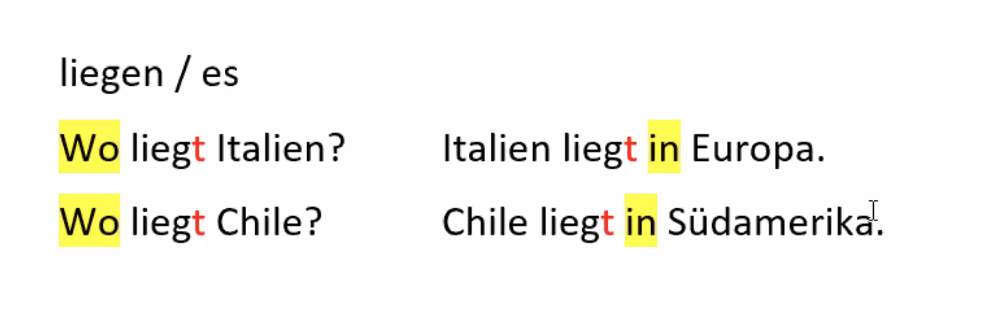

W-Fragen  

<!---->

Was ist das?	> Das ist eine Tasse.  
Wo wognt sie? > Sie wohnt in Berlin.  
Woher kommst du? > Ich komme aus Italien.  

Ja / Nein - Fragen  

<!---->

Sprechen Sie Deutsch? Ja. / Nein.  
- Ja, ich spreche Deutsch.  
- Nein, ich spreche Italienisch.  

<!---->
 
der Preis / -e  
die Heimat / -  
das Heimatland / -e  

die Kirche / -n  

bet**en**  
> er bete**t**  
> das Gebet / -e  

bitt**en**  
> er bitte**t**  
> die Bitte / -n

  
KB  
S. 20, U. 1 a,b,c  
S 21., U. 2 b, 3  

AB
S. 21, U. 18  
S. 22, U. 19 a,b,c  
S. 24  
S. 26, U. 5  
