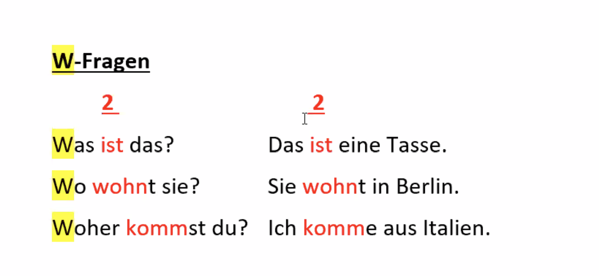

W-Fragen  

<!---->

Was ist das?	> Das ist eine Tasse.  
Wo wognt sie? > Sie wohnt in Berlin.  
Woher kommst du? > Ich komme aus Italien.  

Ja / Nein - Fragen  

<!---->

Sprechen Sie Deutsch? Ja. / Nein.  
- Ja, ich spreche Deutsch.  
- Nein, ich spreche Italienisch.  
