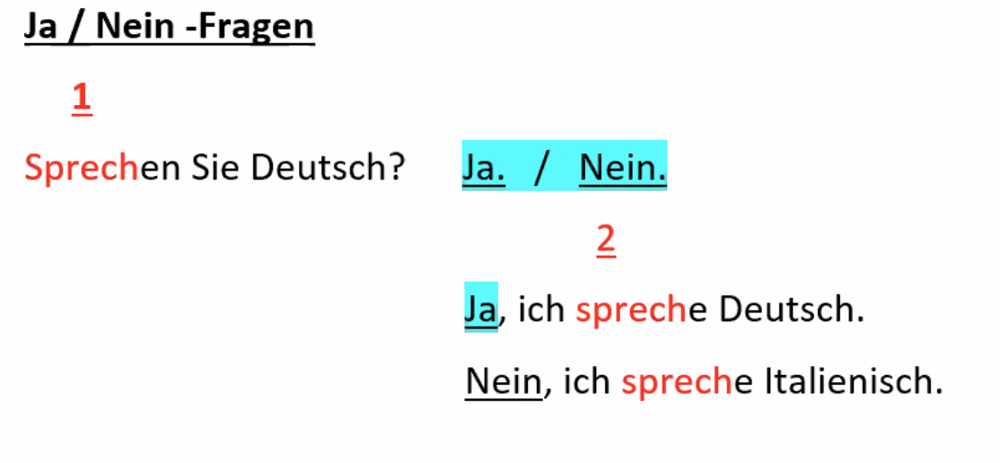
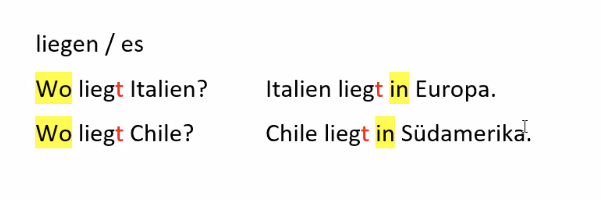

### Deutsch Kurs   
== 
11.01.2021

#### IK 101 - Milena Meyer  

Montag - Donnerstag   
	 17:15 - 18:45  
	 18:45 - 18:55 Pause  
	 18:55 - 20:25  
	 
	 
Frage:  
> Wie heißen Sie?  

Antwort:  
> Ich heiße ....  

##### Unterrichtsmaterial:  

- Block  
- Bleistift  
- Radiergummi  
- Kugelschreiber (blau/schwarz + rot)  
- Lineal  
- Marker  

Buch / Kursbuch / Arbeitsbuch  
> öffnen <> schließen  
> Seite / 1, 6, 9 ...  
> Übung / 1, 2, 7 ...   

> sprechen - Sprechen Sie ..  
> hören - Hören Sie ...  
> lesen - Lesen Sie ...  
> schreiben - Schreiben Sie ...  
> ergänzen - Ergänzen Sie ...  
> **an**kreuzen - Kreuzen Sie **an** ...  
> **nach**sprechen - Sprechen Sie **nach** ...  
> Lesen Sie zu zweit (2 Prs) / zu dritt (3 Prs)  
> Spielen - Spielen Sie ...  
>  
> der Buchstabe - a, d, e, k ...  
> Wort - Tasse, Person ...  
> Satz - Er kommt aus Polen.
> 
> WER (Personen)/WAS ist das? > **S**chule, **B**leistift, **B**uch, **M**ann, **F**rau ...   
> Das ist ein **M**ann / Wer?  
> Dort steht ein **A**uto. / Was?  
> Wort / Satz  
> 
> Frage (?) <--->  Antwort (.)
> 
> **Wie** heißen Sie? > Ich heiße ....  
> **Woher** kommen Sie? > Ich komme aus ...  
> **Wie** lange leben Sie in Deutschland > Ich lebe fünf (5) Jahre (ein Jahr) in Deutschland.  
> **Wo** wohnen Sie? > Ich wohne **in** Berlin ...   
> **Was** **sind** Sie von Beruf? > Ich **bin** Ingenieur von Beruf.
> 
> **Alphabet**  
> 
> **Vokale** - a, e, i, o, u  
> 
> **A a**  
> - **A**uto, **A**pfel  
> - arbeiten  

> **B**e **b**e  
> **B**anane, Buch, Büro ...  
> **b**rauchen ...  

> **C**e **c**e   
> !!! **C**hristoph  
> **C**ent   

> **D**e **d**e  
> **D**ienstag, das **D**atum  
> **d**enken, **d**unkel  

> **E e**  
> **E**lefant, **E**rdbeere  
> **e**ssen, **e**rklären ...   
> !!!! ei -> aj (h**ei**ßen, w**ei**ß, arb**ei**ten)  
> !!!! eu -> oj (L**eu**te, h**eu**te, n**eu**n)   

##### 12.01.2021

> **eF ef**  
> **F**enster, **F**arbe, **F**rage  
> **f**a*h*ren, **f**ragen  
> 
> **Ge ge**  
> **G**abel, **g**eschenk  
> **g**e*h*en, **g**eben,  
> 
> **Ha ha**  
> **H**aare, **H**and  
> **h**ören, **h**elfen  
> 
> **I i**  
> **I**gel, Internet, Impstof  
> **i**nvest**ie**ren,  
> !!!! ie -> ii (prob**ie**ren  
> 
> **Jot jot**  
> **J**a*c*ke, Junge, Januar    
> 
> **Ka ka**  
> **K**atze, **K**ind, **K**uss    
> **k**aufen, kommen   
> 
> **eL el**  
> **L**ampe, **L**öwe   
> **l**essen, **l**eben, **l**ieben  
> 
> **eM em**  
> **M**utter, **M**aus  
> **m**achen, **m**alen,   
> 
> **eN en**  
> **N**atur, **N**ase   
> **n**iesen, **n**ehmen  
> 
> **O o**  
> **O**ma, **O**pa, **O**hr   
> **o**range  
> 
> **Pe pe**  
> **P**apier, Papa    
> **p**robieren  
> 
> **Qu qu**  
> !!!! qu -> kw **Qu**ark, **Qu**alität  
> 
> **eR er**  
> **R**egion, **R**adio, **R**ose  
> **r**iechen, **r**ufen   

> **eS es**  
> !!!!  
> S + Vokal -> z  
> Sonne, Suppe, sagen, sehen  
> 
> -ss    
> Nu**ss**, Ku**ss**, nass, küssen  
> 
> **-st / -sp** -> **-sht / -shp**  
> **st**ehen, **sp**ielen, **Sp**ort, **St**raße, **st**rom, **sp**rechen  
> 
> **-sch**  
> **sch**wimmen, **sch**reiben    
> 
> **-tsch**  
> Deu**tsch**land   
> 
> **Te te**  
> **T**ag, **T**isch, **T**ier  
> **t**ragen, **t**elefonieren  
> 
> **U u**  
> **U**hr, **U**rlaub  
> **u**ntersuchen, **u**nterwegs  
> 
> **Vau vau**  
> **V**ogel  
> **v**erstehen, **v**erkaufen  
> 
> **We we**  
> **W**ohnung, **W**ort, **W**oche, **W**elt  
> **w**arm  
> 
> **iX ix**
> **X**ylophone
> 
> **Ypsilon**  
> **Y**oga  
> 
> **Zett zett**  
> **Z**ahn,  
> **z**usammen,   
> 
> **ß - Eszett  ß = ss**  
> Stra**ß**e, wei**ß**, hei**ß**en,   
> 
> **Umlaut - Ä, Ö, Ü**  
> 
> **Ä ä = ae**  
> Pr**ä**sident, Sekret**ä**rin, **Ä**rztin, Äpfel ...  
> 
> **Ö ö = oe**  
> **ö**ffnen, sch**ö**n ...  
> 
> **Ü ü = ui**  
> Gr**ü**n, **Ü**bung,  

#### 13.01.2021

der Mann / viele Männer  
die Frau / viele Frauen  
das Kind / viele Kinder  

!!!!  
**die** Trepp**e** - 99% e am ende -> **die**  

die Treppe / viele Treppen  
das Haus / viele Häuser  
===> das Treppenhaus / viele Treppenhäuser  

die Hose / viele Hosen  
die Jacke / viele Jacken  
die Lampe / viele Lampen  

die Kommode / viel**e** Kommode**n**
der Nachbar / viel**e** Nachbar**n**
die Nachbarin / viel**e** Nachbarin**nen**

der Vater / viel**e** V**ä**ter  
die Mutter / viel**e** M**ü**tter  
der Sohn / viel**e** S**ö**hn**e**  
die Tochter / viel**e** T**ö**chter  

>  
steh**en**  
sprech**en**  
heiß**en**  
vohn**en**  
komm**en**  
schreib**en**  
hör**en**  
les**en**
sitz**en**  
lach**en**  
lächel**n**  

Woher kommen Herr Costa und Manu?  
Herr Costa und Manu kommen aus Argentinien.  

Wie heißt der Sohn von Paolo Costa?  
Der Sohn heißt Manu.  

0 null  
1 eins  
2 zwei  
3 drei  
4 vier  
5 fünf  
6 sechs  
7 sieben  
8 acht  
9 neun  
10 zehn  
11 elf  
12 zwölf  
13 dreizehn  
14 vierzehn  
15 fünfzehn  
16 sechzen  
17 siebzehn  
18 achtzehn  
19 neunzehn  
20 zwanzig  
30 dreißig !!!  
40 vierzig  
50 fünfzig  
60 sechzig  
70 siebzig  
80 achtzig  
90 neunzig  
100 (ein-) hundert  

01 57 50 90 58 88 - Meral  

01 76 31 18 12 56 - Ayelen  

#### 14.01.2021

AB S4 U5

Woher kommen Sie?  

Ich komme aus der Ukraine.  

Ich wohne schon lange hier.  

Ich bin neu hier im Haus.  

Mein Name ist Georg Hauser.  

lern**en**  
schreib**en**  
mach**en**  
steh**en**  

lern  | **en**  
der Stamm | die **Endung**  

#### Verben ---- konjugieren / Konjugation  

##### lern*en*

ich lern**e**  
du lern**st**  
er,sie,es lern**t**  
wir lern**en**  
ihr lern**t**  
sie, Sie lern**en**  

**Ich** wohn**e** in Berlin. /*ich*  
**Julia**, wohn**st** **du** auch in Berlin? /*du*  
**Der Mann** sitz**t** hier, **er** lern**t** Deutsch. /*er*  
**Die Frau** komm**t** nicht, **sie** bleib**t** zu Hause. /*sie*   
**Das Kind** spiel**t**, **es** spiel**t** gerne. /*es*  

Ich und meine Tochter wohnen in Berlin. Wir lieben Berlin. /*wir*  

##### informell:  
Anna und Amina, wohnt ihr auch in Berlin? /*ihr*  

Der Mann, die Frau und das Kind wohnen in Berlin und sie lernen Deutsch. /*sie*  

##### formell:  
Frau Schmidt und Herr Bauer, wo wohnen Sie? /*Sie*  
Herr Bonev, wann kommen Sie? /*Sie*  

##### Stamm -en

|Pers. / Verbe | kommen | wohnen | schreiben | leben |
|--------------|--------|--------|-----------|-------|
|ich 			  | komm**e**  | wohn**e**  | schreib**e**  | leb**e**  |
|du  			  | komm**st** | wohn**st** | schreib**st** | leb**st** |
|er / sie / es | komm**t**  | wohn**t**  | schreib**t**  | leb**t**  |
|wir			  | komm**en** | wohn**en** | schreib**en** | leb**en** |
|ihr           | komm**t**  | wohn**t**   | schreib**t** | leb**t**  |
|sie / Sie     | komm**en** | wohn**en**  | schreib**en** | leb**en** |

##### Stamm -d / -t Hilfs -e

|Pers. / Verbe | warten | arbeiten | finden |
|--------------|--------|--------|-----------|
| ich			  | wart**e**  | arbeite| finde |
| du  		     | wart*e* **st** | arbeitest    | findest |
| er / sie /es | warte**t** | arbeitet | findet |
| wir          | wart**en** 		| arbeiten      | finden     |
| ihr			  | wart*e* **t** 	   | arbeitet | findet  |
| sie / Sie    | wart**en**  	   | arbeiten | finden |

##### Stamm -s, -ss, -ß, -tz  

|Pers. / Verbe | kü==ss==**en** | heißen | sitzen |
|--------------|--------|--------|-----------|
| ich			  | küss**e**  | heiß**e** | sitz**e** |
| ==du==  		     | küss==**t**== | heiß==**t**== | sitz==**t**== |
| er / sie /es | küss**t** | heiß**t** | sitz==**t**== |
| wir          | küss**en** | heiß**en** | sitz**en** |
| ihr			  | küss**t**| heiß**t** | sitz**t** |
| sie / Sie    | küss**en** | heiß**en** | sitz**en** |

#### sein

ich bin  
du bist  
er/sie/es ist  
wir sind  
ihr seid  
sie/Sie sind  

Wer ist das? Das ist ein Mann / Petr.  
Wie ist heute das Wetter? Das Wetter ist schön.  

Elena und Vitali, ==seid== **ihr** zu Hause? Ja, **wir** ==sind== zu Hause.  

#### haben

ich habe  
du ==hast==  
er/sie/es ==hat==   
wir haben  
ihr habt  
sie/Sie haben  

HA Hausaufgabe  
KB Kursbuch  
AB Arbeitsbuch  

##### Hausaufgabe

==KB== Seite 13 / U. 5a, 5b  
==AB== Seite 5 / U. 6a, 6b, 7a, 7b  
   Seite 8 / U. 16 - 19b  
   Seite 9 / U. 20, 21  

##### 18.01.2021

Ich bin neu hir im Haus.  
Mein Name ist Georg Hauser.  

begrüßen / du begrüßt  
die Begrüßung / viel**e** Begrüßung**en**  
verabschied**en** / du verabschiede**st**  
der Abschied / viel**e** Abschied**e**  
zeichn**en** / er zeichne**t**  
die Zeichnung / viel**e** Zeichnung**en**  

ich zeichn**e**  
du zeichne**st**  
er/sie/es zeichne**t**  
wir zeichn**en**  
ihr zeichne**t**  
sie/Sie zeichn**en**  

**der Name**  
> **der Vorname**  
> **der Familienname** / **der Nachnam**e  

die Adresse  
Wie ist Ihre Adresse?  

Meine Adresse ist Nelkenstraße 5, 12345 Berlin.  

Nelkenstraße - die Straße / viele Straßen  
> 5 - die Hausnummer  
> 12345 PLZ - die Postleitzahl  
> Berlin - der Ort / der Wohnort  
> Lichtenberg, Spandau, Marzahn - der Bezirk, der Stadtbezirk  
> die Nummer / viele Nummern  
> das Telefon / viele Telefone  
> die Telefonnummer  
> die Vorwahl - 030 / 0049 / +49  

Email - abc@def.com  
> **@** - at  
> **.** - der Punkt  

der Kurs / die Kurse  
> der Anfänger  
> der Anfängerkurs - A1.1  
> der/die Fortgechrittene - A2.1  

Was sind Sie von Beruf?  
Der Beruf / viele Berufe  

Ich habe keinen Beruf, ich bin Hausfrau / Hausmann.  

die Schule / die Schulen  
die Sprache / viele Sprachen  
die Sprachschule  
die Muttersprache  
die Fremdsprache  
die Zweitsprache  
==die== Anmeld==ung== / viele Anmeldungen  

Wo==**her**== kommet er? Er kommt aus Spanien.  
das Herkunftsland / Herkunfstl**ä**nd**er**   

Hausaufgabe:  
AB S. 10 / U. 23-26b  
   S. 12 - in Muttersprache   

##### 19.01.2021  

**das** Jahr / viel**e** Jahr**e**  
der Monat / viel**e** Monat**e**  
**die** Woche / viel**e** Woch**en**   
der Tag / viel**e** Tag**e**  

06:00 Uhr - 10:00 Uhr  der Morgen  
10:00 Uhr - 12:00 Uhr der Vormittag  
12:00 Uhr - 14:00 Uhr der Mittag  
14:00 Uhr - 18:00 Uhr der Nachmittag  
18:00 Uhr - 22:00 Uhr der Abend  
22:00 Uhr ...			  **die** Nacht  

**!!!!** Zeit angaben alle mit "der"  (außer das Jahr, die Woche, die Nacht ...)  

die Woche - 7 Tag**e**  
die Arbeitswoche - 5 Tag**e** / der Werktag   

das Wochenende:  
- der Samstag / Sonnabend  
- der Sonntag  

der Wochentag:  
- der Montag  
- der Dienstag  
- der Mittwoch  
- der Donnerstag  
- der Freitag

begrüßen / du begrüßt  
die Begrüßung / viel**e** Begrüßung**en**  

verabschied**en** / du verabschiede**st**  
der Abschied / viel**e** Abschied**e**  

#### Verben mit VOKALWECHSEL  

##### Vokalwechsel e --> i   NUR !!!! Singular du + er, sie, es  

| Pers | sprech**en** | ess**en** | geb**en** | nehm**en** |
|---|---|---|---|---|
| ich | sprech**e** | ess**e** | gebb**e** | nehm**e** |
| du | sprich**st** | is**st** | gib**st** | nimm**st** |
| er, sie, es | sprich**t** | iss**t** | gib**t** | nimm**t** |
| wir | sprech**en** | ess**en** | geb**en** | nehm**en** |
| ihr | sprech**t** | ess**t** | geb**t** | nehm**t** |
| sie/Sie | sprech**en** | esse**n** | geb**en** | nehm**en** |

##### Vokalwechsel e --> ie NUR !!! Sg. du + er,sie,es  

| Pers | les**en** | seh**en** |
|---|---|---|
| ich | les**e** | seh**e** |
| du | lie**st** | sieh**st** |
| er, sie, es | lie**st** | sieh**t** |
| wir | les**en** | seh**en** |
| ihr | les**t** | seh**t** |
| sie/Sie | les**en** | seh**en** |

##### Vokalwechsel   a --> ä  NUR Sg. du + er, sie, es

| Pers. | fahren | schlafen | laufen |
| ----- | ------ | -------- | ------ |
| ich   | fahr**e**  | schlaf**e**  | lauf**e**  |
| du    | fähr**st** | schälf**st** | läuf**st** |
| er, sie, es | fährt | schläf**t** | läuf**t** |
| wir | fahr**en** | schlaf**en** | lauf**en** |
| ihr | fahr**t** | schlaf**t** | lauf**t** |
| sie, Sie | fahr**en** | schlaf**en** | lauf**en** |

HA. AB. S. 6 / U. 11a  
S. 7 / U. 13, 15  
S. 12 + 13  

##### 20.01.2021

der Januar  
der Februar  
der März  
der April  
der Mai  
der Juni  
der Juli  
der August  
der September  
der Oktober  
der November  
der Dezember  

**!!!!** Zeit angaben alle mit "**der**"  (ex. **das Jahr**, **die Woche**, **die Nacht** ...)  

die Tür  
das Fenster  
die Uhr  
der Stuhl  
das Plakat  
die Tafel  
die Lampe  
die Flasche  
das Tablet  
das Papier  
das Wörterbuch  
der Kugelschreiber (der Kuli)  
der Tisch  
der USB-Stick  
der Schlüssel  
das Handy  
das Heft  
die Brille  
das Buch  
die CD  
die Tasche  
der Laptop  

| Artikel | bestimmt | unbestimmt |
| ------- | -------- | ---------- |
| maskulin (m) | der (r) | ein |
| neutral | das (s) | ein |
| feminin | die (e) | eine |
| Plural | die | --- |

==maskulin der / ein==  

der Mann  
Wer ist das?   
Das ist ein Mann.  
Der Mann kommt aus China.  

der Tisch  
Was ist das?  
Das ist ein Tisch.  
Der Tisch kostet 50,00 euro.  

==neutral das / ein==  

das Kind  
Wer spielt dort?  
Dort spielt ein Kind.  
Das Kind heißt Peter.  

das Regal  
Was ist das?  
Das ist ein Regal.  

==feminin  die /eine==  

die Frau  
Wer ist das?   
Das ist eine Frau.  
Die Frau kommt aus Italien.  

die Lampe  
Was hängt dort?  
Dort hängt eine Lampe.  
Die Lampe ist alt.  

==Plural==  

die Frau**en**  
die Kind**er**  
die M**ä**nn**er**  

die Brille / die Brillen  

**HA**  
AB S. 17, U. 5  

##### 21.01.2021

die Zeit / die Zeiten  
das Jahr / die Jahre  
die Jahreszeit  

4 Jahreszeiten  

der Winter  
der Frühling  
der Sommer  
der Herbst  

Welchen Sprachen spr**i**ch**t** Anna?  
> Anna spricht Russisch und Italienisch.  
> Sie spricht Russisch und Italienisch.  

Was ist die Muttersprache von Anna?  
(**Genitiv**) Was ist Anna**s** Muttersprache?  

Die Muttersprache *von Anna* ist Russisch.  
Anna**s** Muttersprache ist Russisch.  

Die Muttersprache von Alex ist Polnisch.  
Alex' Muttersprache ist Polnisch.  

| Zahlen | |
| ------ | --------- |
| 21 | einundzwanzig |
| 32 | zweiunddreißig|
| 43 | dreiundvierzig |
| 54 | vierundvierzig|
| 65 | fünfundsechzig |
|76 | sechsundsiebzig |
| 87 | siebenundachtzig |
| 98 | achtundneunzig |
| 107 | (ein-) hundertsieben |
| 211 | zweihundertelf |
| 345 | dreihundertfünfundvierzig |
| 701 | siebenhunderteins |
| 839 | achthundertneununddreißg |
| 666 | sechshundertsechsundsechzig |
| 777 | siebenhundertsiebenundsiebzig |
| 863 | achthundertdreiundsechzig |
|938 | neunhundertachtunddreißig |
|7003 | siebenhundertdrei |
|454 | vierhundertvierundfünfzig |
|899 | achthundertneunundneunzig |
|356 | dreihundertsechsundfünfzig |

schmutzig <> sauber  
voll <> leer  
süß <> sauer  
süß <> bitter  
scharf <> mild  
modern <> altmodisch (vintage)  
neu <> alt  
billig <> teuer  
schön <> hässlich  

das Ding, die Dinge  

| Sing. | Plural |
| ----- | ------ |
| 1. **(")** | **-//-** |
| **das** Fenster | **die** Fenster |
| **der** Computer | **die** Computer |
| **der** Vater | **die** V**ä**ter |
| **der** Apfel | **die** **Ä**pfel |
| 2. **(")** | **-e** |
| **der** Tisch | **die** Tische |
| **der** Stuhl | **die** Stühle |
| **der** Stift | **die** Stifte |
| 3. **(")** | **-er** |
| **das** Kind | **die** Kinder |
| **das** Bild | **die** Bilder |
| **das** Buch | **die** Bücher |
| **der** Mann | **die** Männer |
| 4. **-n / -en** | **-e / -en** |
| **die** Tür | **die** Türen |
| **die** Frau | **die** Frauen |
| **die** Lampe | **die** Lampen |
| **die** Tomate | **die** Tomaten |
| 5. **\*** | **-s** |
| **das** Restaurant | **die** Restaurants |
| **das** Radio | **die** Radios |
| **das** Auto | **die** Autos |

<!--

-->

**HA**  
KB  
S. 23 / U. 4  
S. 24 / U. 3a  

AB  
S. 18 / U 8, 9a  
S. 19 / U. 9b, 10a + b  
S. 20 / U. 12a, 14  

##### 25.01.2021

W-Fragen  

<!---->

Was ist das?	> Das ist eine Tasse.  
Wo wohnt sie? > Sie wohnt in Berlin.  
Woher kommst du? > Ich komme aus Italien.  

Ja / Nein - Fragen  

<!---->

Sprechen Sie Deutsch? Ja. / Nein.  
- Ja, ich spreche Deutsch.  
- Nein, ich spreche Italienisch.  

<!---->

der Preis / -e  
die Heimat / -  
das Heimatland / -e  

die Kirche / -n  

bet**en**  
> er bete**t**  
> das Gebet / -e  

bitt**en**  
> er bitte**t**  
> die Bitte / -n

KB  
S. 20, U. 1 a,b,c  
S 21., U. 2 b, 3  

AB
S. 21, U. 18  
S. 22, U. 19 a,b,c  
S. 24  
S. 26, U. 5  

##### 27.01.2021

Welches Datum ist heute?  
Heute ist der 27. /**siebenundzwanzig==ste==**  

> 01. / Erste 

1.-19. -> -te  
ab 20. -> -ste  

**Artikel**  

| bestimmt | unbestimmt | negativ |
| -------- | ---------- | ------- |
| der | ein | kein |
| das | ein | kein |
| die | eine | keine |
| (Pl.) die | --- | keine |

der Schlüssel (-)  
der USB-Stick (s)  

Ist das ein Schlüssel?  
Nein, das ist kein Schlüssel.  
Das ist ein USB-Stick.  

Sind das die Schlüssel?  
Nein, das sind kein Schlüssel.  
Das sind die USB-Sticks.  

die Bücher   
die Hefte   

Malika - 0178 620 338 06

HA

AB. S. 25, U 1a+b, 2, 3  
KB S. 29, U. 1, 2 

##### 29.01.2021 

**Nominativ**  

Wer/was?   sein, stehen, heißen  

maskulin > der/ein/kein Mann, Schrank  
neutral  > das/ein/kein Kind, Handy  
feminin  > die/eine/keine Frau, Lampe  
Plural   > die/---/keine Männer, Kinder, Frauen  

**Akkusativ**  

Wenn/was?  haben, brauchen, kaufen ...  

maskulin  > den/einen/keinen Mann, Schrank  
neutral   > das/ein/kein Kind, Handy  
feminin   > die/eine/keine Frau, Lampe  
Plural 	> die/---/keine Männer, Frauen, Kinder  

der Schrank / "-e  

Dort steht ein Schrank.  
Der Schrank ist schön.  
Ich habe einen Schrank. Ich brauche keinen Schrank.  

das Regal / -e  

Dort steht ein Regal.  
Das Regal ist teuer.  
Ich habe ein Regal.  
Ich brauche kein Regal.  

die Lampe / -n  

Da hängt eine Lampe.  
Die Lampe kostet 50,00 Euro.  
Er hat eine Lampe. Er braucht keine Lampe.  

der Stuhl // die/---/keine Stühle - Pl.  

Dort stehen X Stühle.  
Die Stühle sind bequem.  
Anna hat X Stühle. Sie braucht keine Stühle.  

AB. S. 31 U. 3a  

>  

finden / er findet + Ak.  
Er sucht die Brille. Er findet die Brille.  

Wie findest du den Schrank?  
Ich finde den Schrank sehr schön.  
Der Schrank ist sehr schön.  

HA.  

KB.  
S. 30, U. 1a  
S. 32, U. 2a  

AB.  
S. 29, U. 5b, 6  
S. 30, U. 8, 9  
S. 31, U. 10, 11, 12, 13  