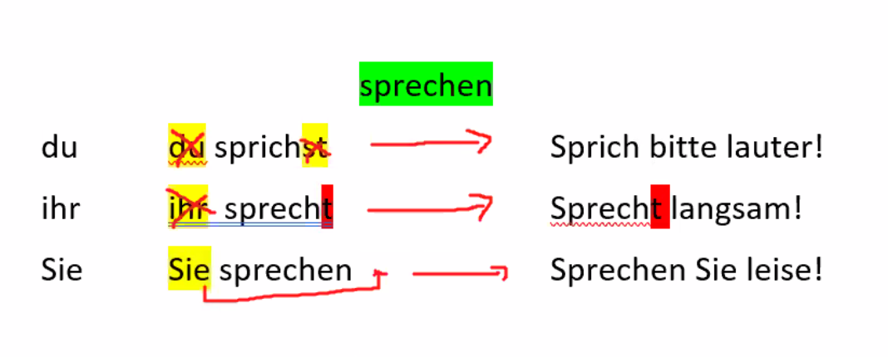
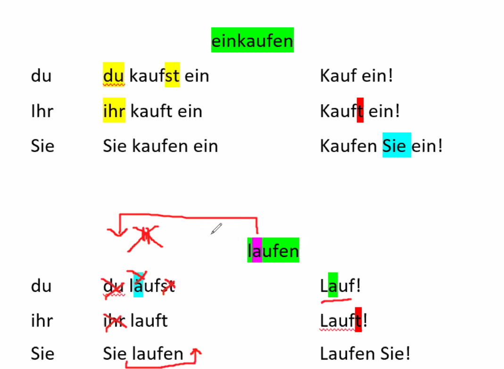
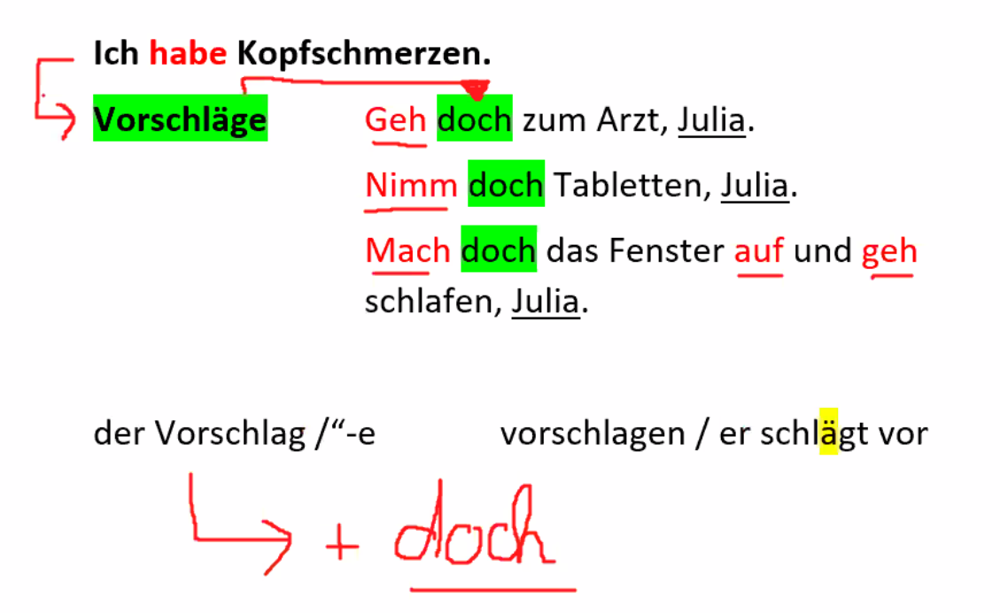
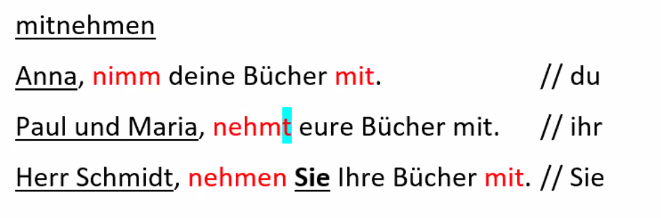

das Gemüse  
das Obst  
der Fehler /-  
keinen Fehler  

vertrauen / er vertraut / das Vertrauen  

basteln  

der Grill / grillen / er grillt  
die Grillkohle 

die Gießkanne / gießen / er gießt   
die Pflanze / -n  

Ich trinke oft Tee.  
Ich esse selten Salat.  
Ich räume oft auf.  
Ich mache manchmal einen Ausflug.  
Ich fahre oft Auto.  
Ich lerne täglich Deutsch.  
Ich höre manchmal Music.  

wo sind ...  
was macht ...  
was sehe ich noch ...  

### Imperativ

**kommen**

| informell   |        |             |
| ----------- | ------ | ----------- |
| du          | kommst | Komm!       |
| ihr         | kommt  | Kommt!      |
| **formell** |        |             |
| Sie         | kommen | Kommen Sie! |

**sprechen**

| **du** | du sprichst  | Sprich!       |
| ------ | ------------ | ------------- |
| ihr    | ihr sprecht  | Sprecht!      |
| Sie    | Sie sprechen | Sprechen Sie! |

 

