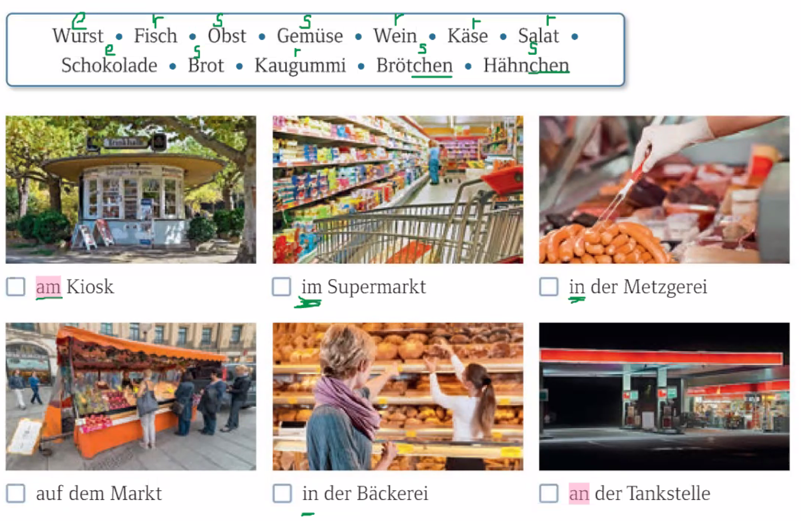

KB S. 58 U. 2a

| Montag                | Dienstag              | Mittwoch                                             | Donnerstag               | Freitag           | Samstag / Sonntag         |
| --------------------- | --------------------- | ---------------------------------------------------- | ------------------------ | ----------------- | ------------------------- |
| 08:00 schwimmen gehen | 14:00 Freunde treffen | 11:00 Deutsch lernen  16:00 Hausaufgaben machen | 16:00 Verwandte besuchen | 13:00 essen gehen | 08:00 nach München fahren |

anfangen - er fangt an  

kegeln - er kegelt 

| keg==eln==       |                   |
| ---------------- | ----------------- |
| du kegelst       | kegel / kegle     |
| ihr kegelt       | kegelt            |
| Sie kegeln       | Kegeln Sie!       |
| **wechs==eln==** |                   |
| du wechselst     | wechsel / wechsle |
| ihr wechselt     | wechselt          |
| Sie wechseln     | Wechseln Sie!     |

| Imperativ | du           | ihr           | Sie                |
| --------- | ------------ | ------------- | ------------------ |
| sagen     | sag          | sagt          | sagen Sie          |
| gehen     | geh          | geht          | gehen Sie          |
| schreiben | schreib      | schreibt      | schreiben Sie      |
| mitkommen | komm ... mit | kommt ... mit | kommen Sie ... mit |
| anrufen   | ruf ... an   | ruft ... an   | rufen Sie ... an   |
| schlafen  | schlaf       | schlaft       | schlafen Sie       |
| fahren    | fahr         | fahrt         | fahren Sie         |
| aufräumen | räum ... auf | räumt ... auf | räumen Sie ... auf |
| lesen     | lies         | lest          | lesen Sie          |
| vorlesen  | lies ... vor | lest ... vor  | lesen Sie ... vor  |

| Mengenangaben | die Menge / -n, die Angabe / -n |
| ------------- | ------------------------------- |
| 1g            | 1 Gramm                         |
| 1 kg          | 1 Kilogramm / Kilo              |
| 1 Pfd.        | 1 Pfund - 500 Gramm             |
| 1 L           | 1 Liter                         |

| möchten + Ak. |          |
| ------------- | -------- |
| ich           | möchte   |
| du            | möchtest |
| er, sie, es   | möchte   |
| wir           | möchten  |
| ihr           | möchtet  |
| sie, Sie      | möchten  |

der Verkäufer /-  
die Verkäuferin / -nen

verkaufen/ er verkauft + Ak. 

der Kunde / -n  
die Kundin / -nen  

kaufen / sie kauft + Ak.   
einkaufen / sie kauft ein + Ak. 

Was / Wie viel kosten die Tomaten?  
... kostet der Salat?  
Der Salat kostet 1,50 Euro.  
... ein Euro fünfzig (Cent)  
... eins fünfzig  
Die Tomaten kosten heute 0,80 Cent.  
... achtzig Cent

Was möchten Sie / wünschen Sie / hätten Sie gern?   
Ich möchte / hätte gern ein Kilo Tomaten. 

Haben Sie noch einen Wunsch?   
Nein danke, das ist alles.  
der Wunsch / "-e  
wünschen + Ak. / er wünscht   

Das macht zusammen 12,60 Euro.  Haben Sie es passend?  
Nein, ich habe nur 20 Euro.  
Alles klar, hier 7,40 Euro zurück.  
das Wechselgeld  