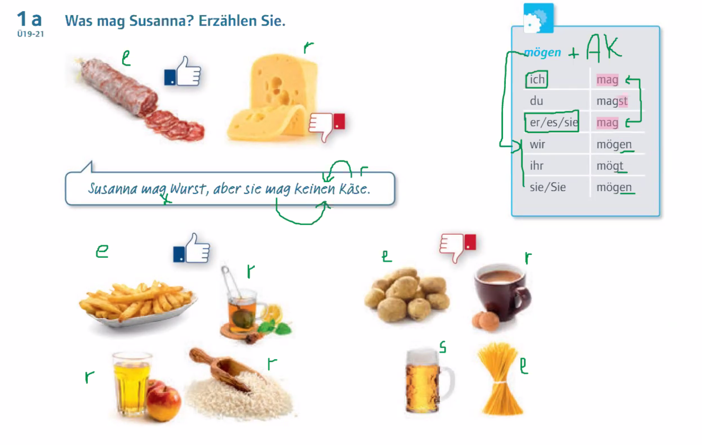
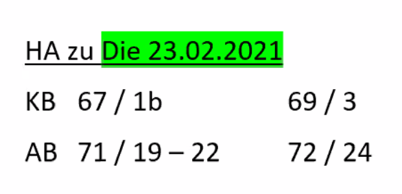

gern / nicht gern      ----      mögen  

Sie isst gern Käse.   ------   Sie mag Käse.   
Sie isst nicht gern Käse.   -----   Sie mag keinen Käse.  

Er trinkt gern Milch.  ------   Er mag Milch  
Er trinkt nicht gern Milch. ----- Er mag keine Milch.  

das Netz / -e  
die Schale / -n  

| mögen     |       |
| --------- | ----- |
| ich       | mag   |
| du        | magst |
| er/sie/es | mag   |
| wir       | mögen |
| ihr       | mögt  |
| sie/Sie   | mögen |

| möchten   |          |
| --------- | -------- |
| ich       | möchte   |
| du        | möchtest |
| er/sie/es | möchte   |
| wir       | möchten  |
| ihr       | möchtet  |
| sie/Sie   | möchten  |

#### Essenzeiten 

das Frühstück - frühstücken / er frühstückt  
das Mittagessen  
das Abendessen  / das Abendbrot  

die Kaffeezeit  

die Kantine / -n  
die Selbstbedienung / -en  
das Restaurant   
die Bedienung  - der Kellner / die Kellnerin   
bedienen / er bedient   
der Unterschied / -e  
Sie ==frühstückt== zwischen 7 und 8 Uhr.  

