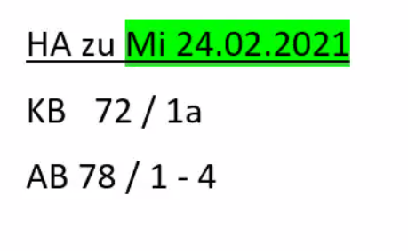

**KB S. 68 U. 1 und S. 85 U.1**

**KB S. 71** 

das Haus /"-er		das Gebäude /-  
die Baustelle /-n		der Bauarbeiter /-  
								der Ingenieur /-e  
das Restaurant /-s		die Bedienung / -en  
bedienen +Ak. 			der Kellner  
								die Kellnerin  
								der Gast / "-e  
die Küche / -n		der Koch / "-e  		die Köchin / -nen  
das Büro				  
die Altenpflegerin / -nen		der Altenpfleger / -  
der Patient / -en 			die Patientin / -nen   
die Werkstatt / "-e 		die Autowerkstatt / Kfz-Werkstatt  
das Kfz - das Kraftfahrzeuge => das Auto   
der Autofahrer / -			die Autofahrerin / -nen  
der Hubschrauber  
der Pilot / -en			die Pilotin / -nen  
der Briefträger / -			die Briefträgerin / -nen  
der Paketzusteller /-		die Paketzustellerin / -nen  

der Beruf				Er ist Lehrer von Beruf.  
							  Er **arbeitet** in Deutschland **als** Verkäufer.  

verdienen				er verdient gut / schlecht   
der Verdienst / -e			das Gehalt / "-er  
										der Lohn / "-e  	der Stundenlohn  

die Schicht / -en  
das Schichtsystem  
der Schichtdienst 			06:00 - 14:00 / 14:00 - 22:00 / 22:00 - 06:00  

vorstellen + Ak.  
Meine Kollegin ==stellt== ihren Mann ==vor==.  

vorbereiten + Ak.  
Er bereit<u>e</u>t Operationen vor.  

unterstützen + Ak.  
Er unterstütz seinen Sohn.  

HA  
KB S. 72 U. 1a   
AB S.  78 1 - 4

