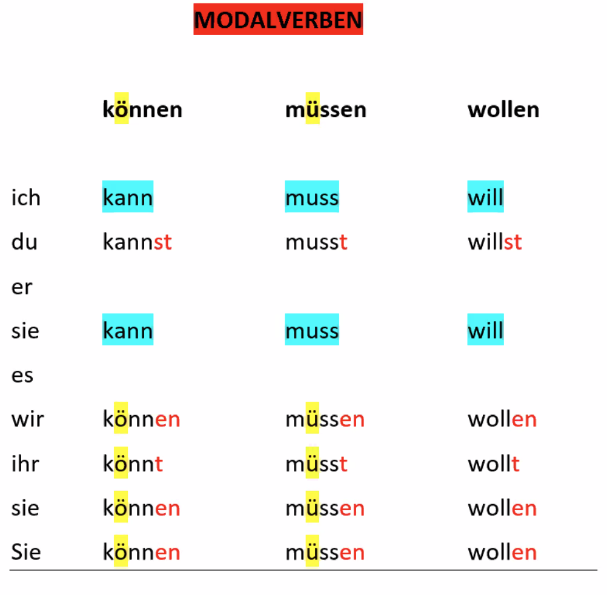
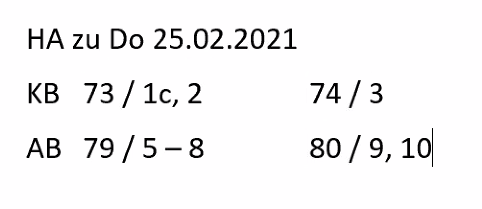

### Modalverben

|             | können | müssen | wollen |
| ----------- | ------ | ------ | ------ |
| ich         | kann   | muss   | will   |
| du          | kannst | musst  | willst |
| er, sie, es | kann   | muss   | will   |
| wir         | können | müssen | wollen |
| ihr         | könnt  | müst   | wollt  |
| sie, Sie    | können | müssen | wollen |

#### können  

- <u>höfliche Frage</u>:  
  **Können** Sie bitte das Fenster **öffnen**?  
  **Kannst** du mir den Stift **leihen**?  

- <u>Fähigkeit</u>  
  Pavel **kann** Gitarre (**spielen**).  
  Irina **kann** ein bisschen Englisch (**sprechen**).

#### müssen

- Pflicht  
  Er fährt mit der S-Bahn. Er **muss** eine Fahrkarte **haben**.  
  Ihre Tochter ist 6 Jahre alt. Sie **muss** zur Schule **gehen**.  

#### wollen

- Ziel haben  
  Wir leben in Deutschland. Wir wollen Deutsch lernen, gute Arbeit finden.  
  Jorge will glücklich sein.  

die Bank / -en 	<> die Bank / "-e  
das Geldinstitut / -e  
das Konto / -en					eröffnen / er eröffnet ein Konto  
											schließen / er schließt sein Konto  
Er hat ein Konto bei der Berliner Sparkasse. 
der Kontoauszug / "-e  
der Betrag / "-e					die Summen / -n  
überweisen / er überweist  
die Überweisung / -en  		das Überweisungformular / -e  
ausfüllen / er **füllt** das Formular **aus**  
unterschreiben / er unterschreibt das Formular  
die Unterschrift / -en  
die EC-Karte / -n 				die PIN - die Geheimzahl / -en  
der Geldautomat / -en	  
das Geld							abheben / er **hebt** Geld **ab**  
der Verein / -e 					der Fußballverein  
der Beitrag / "-e				z.B. 60 euro pro Jahr  
der Mitglied / -er 			

#### Song of the day  

