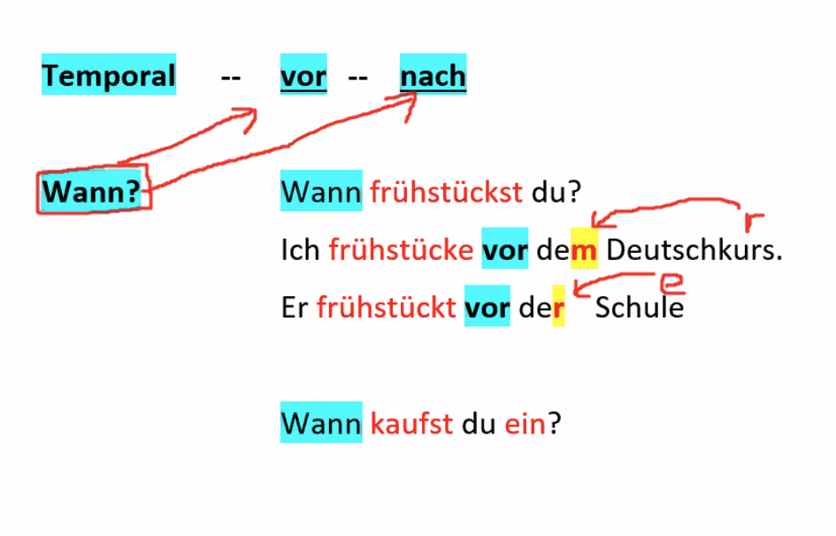
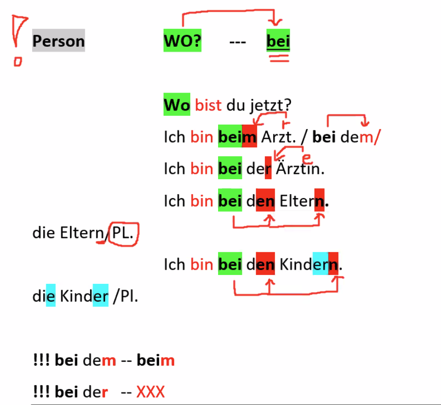
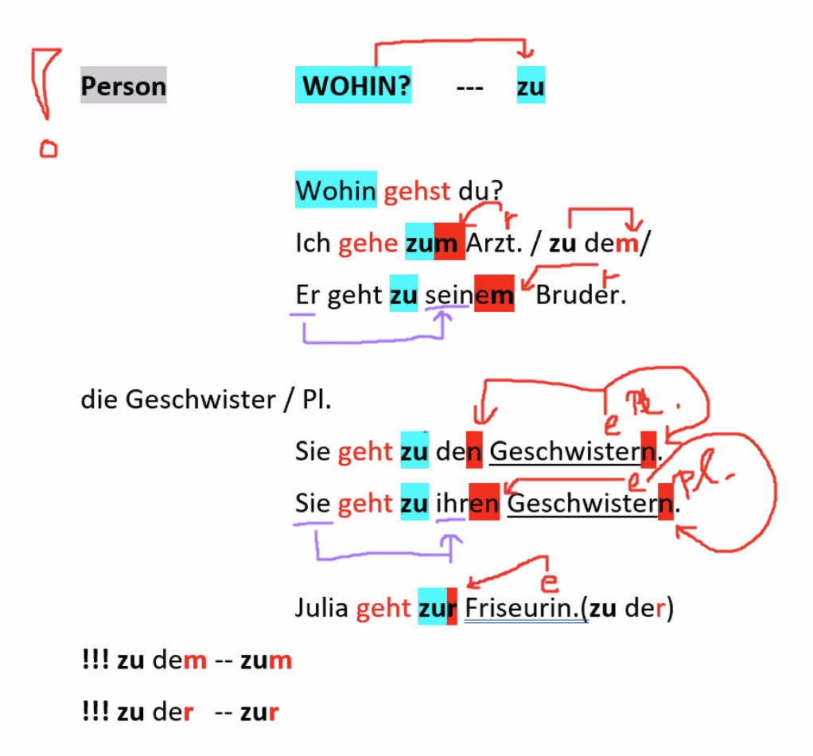
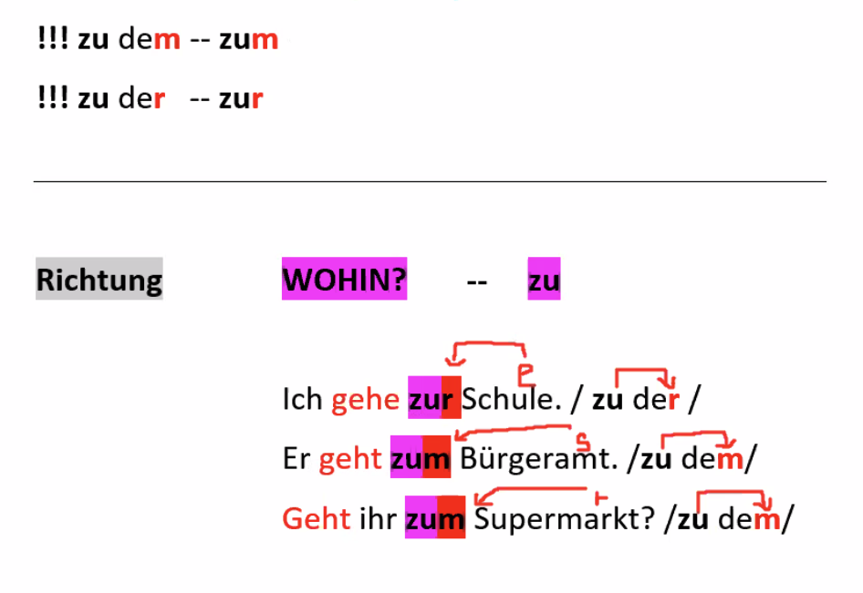
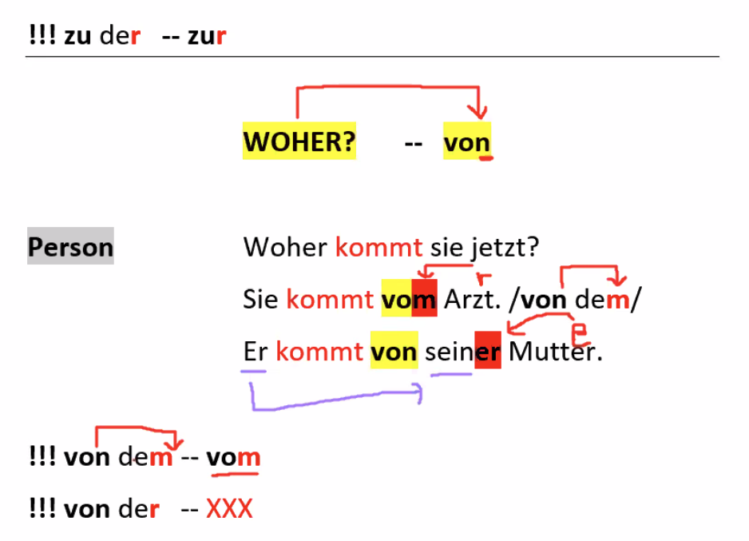
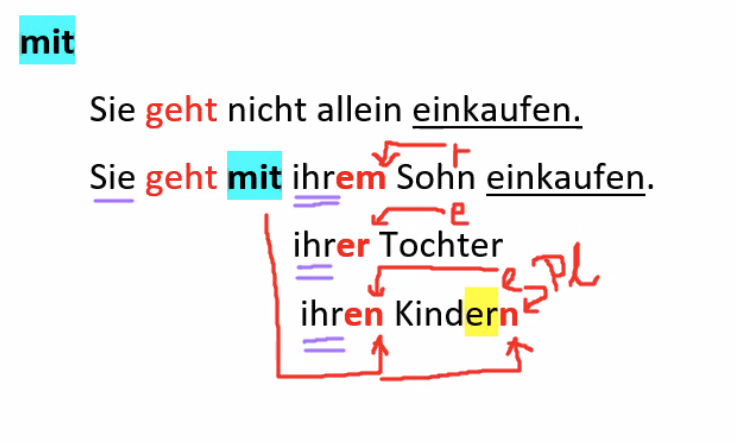
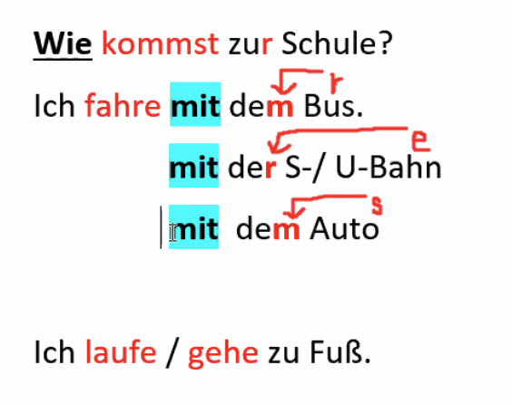
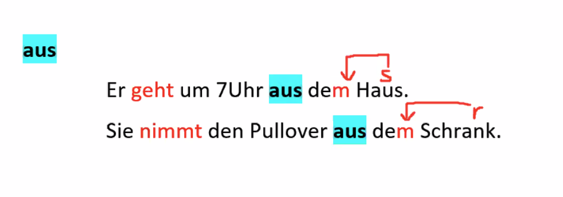
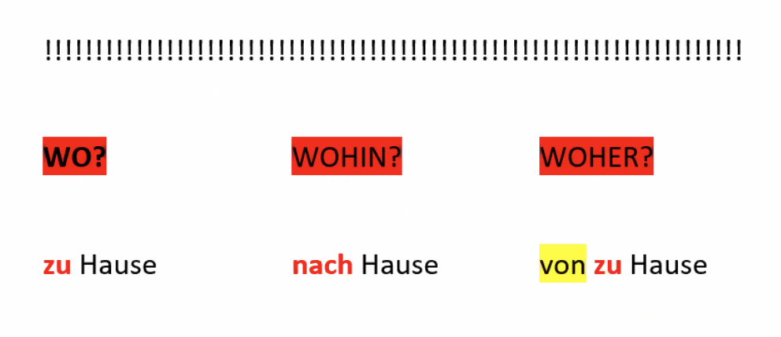
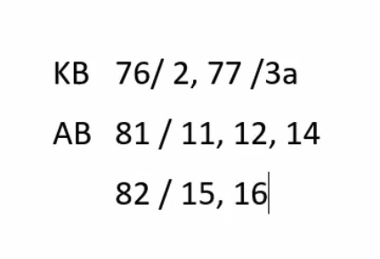

Entschuldigung, was meinden Sie?  

die Anschrift / -en		die Adresse / -n  

die Erfahrung / -en					der Beruf / -e  
die Berufserfahrung / -en  		// die Berufspraxis  
Wie viele Jahre Berufserfahrung (als Ingenieur) haben Sie? 

### Präpositionen mit Dativ (100%)

| Nominativ | der     | das     | die     | die (Pl.)       |
| --------- | ------- | ------- | ------- | --------------- |
| Dativ     | de**m** | de**m** | de**r** | de**n** + **n** |

**aus, bei, mit, von, zu** + (temporal / Wann) **vor / nach**

#### Song of the day

