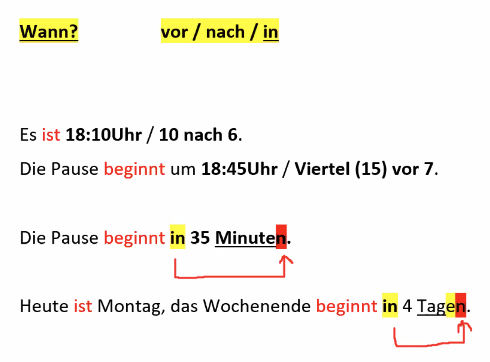

**AB. S. 82 U. 15**  

Bei meiner Arbeit muss ich Pläne machen, Kollegen trainieren und die Arbeit von meinem Kollegen überprufen.  
Bei meiner Arbeit kann ich erfolgreich mit meinen Kenntnissen komplizierte Herausforderungen annehemen erledigen während ich Pijamas trage.
Ich will bei meiner Arbeit mehr Geld verdienen. 

der Arzt / "-e		die Ärztin / -nen  
das Krankenhaus / "-er  
die Arztpraxis / -en  
der Termin / -e 		<u>machen</u> er macht einen Termin  
								<u>vereinbaren</u> / er vereinbart einen Termin  
der Patient / -en			die Patientin / -nen  
die Arzthelferin / -nen 	der Arzthelfer / -  
die Sprechstunde / -n  
die Sprechstundenhilfe   
der Empfang  
die Gesundheitskarte  	die Krankenversichertenkarte  
die Krankenversicherung / -en  
das Wartezimmer / -  
das Sprechzimmer / -  
Was fehlt Ihnen?  
der Schmerz/ -en + haben  
												die Kopfschmerzen  
												die Rückenschmerzen  
												die Zahnschmerzen  
Mein Kopf tut weh.  
Mein Rücken tut weh.  
Meine 2 Zähne tun weh.  
untersuchen / er untersucht + Ak.  
behandeln / er behandelt + Ak.  
das Rezept / -e  
das Medikament / -e  
die Apotheke / -n 

